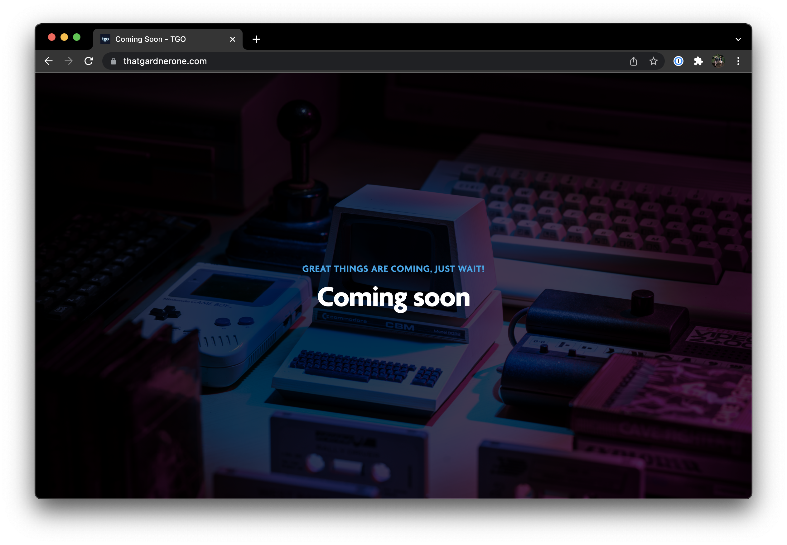

<!-- PROJECT SHIELDS -->
<!--
*** Reference links are enclosed in brackets [ ] instead of parentheses ( ).
*** See the bottom of this document for the declaration of the reference variables
*** for contributors-url, forks-url, etc. This is an optional, concise syntax you may use.
*** https://www.markdownguide.org/basic-syntax/#reference-style-links
-->

[![Apache License][license-shield]][license-url]
[![GitHub forks][forks-shield]][forks-url]
[![GitHub stars][stars-shield]][stars-url]
[![GitHub watchers][watchers-shield]][watchers-url]
[![LinkedIn][linkedin-shield]][linkedin-url]

<!-- PROJECT LOGO -->
 

  

<h3 align="center">
    <a href="https://thatgardnerone.com">ThatGardnerOne</a>
</h3>

TGO provides cutting edge digital services, from web design and development, to server management, and hosting, and everything in between, including photography, videography and graphics.

If you which to contact me regarding any of these services, or to ask for help with something different, please see the Contact section below to get in touch.

  
 
     
    <a href="https://github.com/thatgardnerone/thatgardnerone"><strong>Explore the docs »</strong></a>
     
     
    <a href="https://github.com/thatgardnerone/thatgardnerone">View Demo</a>
    ·
    <a href="https://github.com/thatgardnerone/thatgardnerone/issues">Report Bug</a>
    ·
    <a href="https://github.com/thatgardnerone/thatgardnerone/issues">Request Feature</a>
  

<!-- TABLE OF CONTENTS -->

  
Table of Contents

  <ol>
    <li>
      <a href="#about-the-project">About The Project</a>
      <ul>
        <li><a href="#built-with">Built With</a></li>
      </ul>
    </li>
    <li>
      <a href="#getting-started">Getting Started</a>
      <ul>
        <li><a href="#prerequisites">Prerequisites</a></li>
        <li><a href="#installation">Installation</a></li>
      </ul>
    </li>
    <li><a href="#usage">Usage</a></li>
    <li><a href="#roadmap">Roadmap</a></li>
    <li><a href="#contributing">Contributing</a></li>
    <li><a href="#license">License</a></li>
    <li><a href="#contact">Contact</a></li>
    <li><a href="#acknowledgments">Acknowledgments</a></li>
  </ol>

<!-- ABOUT THE PROJECT -->

## About The Project

Details coming soon! Check back later for updates.

(<a href="#top">back to top</a>)

### Built With

* [Laravel](https://laravel.com)
* [Vue.js](https://vuejs.org/)
* [Tailwind CSS](https://tailwindcss.com)

(<a href="#top">back to top</a>)

<!-- GETTING STARTED -->

## Getting Started

### Prerequisites

### Installation

(<a href="#top">back to top</a>)

<!-- USAGE EXAMPLES -->

## Usage

(<a href="#top">back to top</a>)

<!-- ROADMAP -->

## Roadmap

See the [open issues](https://github.com/thatgardnerone/thatgardnerone/issues) for a full list of proposed features (and known issues).

(<a href="#top">back to top</a>)

<!-- CONTRIBUTING -->

## Contributing

Contributions are what make the open source community such an amazing place to learn, inspire, and create. Any contributions you make are **greatly appreciated**.

If you have a suggestion that would make this better, please fork the repo and create a pull request. You can also simply open an issue with the tag "enhancement". Don't forget to give the project a
star! Thanks again!

1. Fork the Project
2. Create your Feature Branch (`git checkout -b feature/AmazingFeature`)
3. Commit your Changes (`git commit -m 'Add some AmazingFeature'`)
4. Push to the Branch (`git push origin feature/AmazingFeature`)
5. Open a Pull Request

(<a href="#top">back to top</a>)

<!-- LICENSE -->

## License

Distributed under the Apache 2.0 License. See `LICENSE` for more information.

(<a href="#top">back to top</a>)

<!-- CONTACT -->

## Contact

Jamie Gardner - [@thatgardnerone](https://twitter.com/thatgardnerone) - jamie@thatgardnerone.com

Project Link: [https://github.com/thatgardnerone/thatgardnerone](https://github.com/thatgardnerone/thatgardnerone)

(<a href="#top">back to top</a>)

<!-- ACKNOWLEDGMENTS -->

## Acknowledgments

(<a href="#top">back to top</a>)

<!-- MARKDOWN LINKS & IMAGES -->
<!-- https://www.markdownguide.org/basic-syntax/#reference-style-links -->

[contributors-url]: https://github.com/thatgardnerone/thatgardnerone/graphs/contributors

[forks-shield]: https://img.shields.io/github/forks/thatgardnerone/thatgardnerone.svg?style=for-the-badge

[forks-url]: https://github.com/thatgardnerone/thatgardnerone/network/members

[stars-shield]: https://img.shields.io/github/stars/thatgardnerone/thatgardnerone.svg?style=for-the-badge

[stars-url]: https://github.com/thatgardnerone/thatgardnerone/stargazers

[watchers-shield]: https://img.shields.io/github/watchers/thatgardnerone/thatgardnerone.svg?style=for-the-badge

[watchers-url]: https://github.com/thatgardnerone/thatgardnerone/watchers

[issues-shield]: https://img.shields.io/github/issues/thatgardnerone/thatgardnerone.svg?style=for-the-badge

[issues-url]: https://github.com/thatgardnerone/thatgardnerone/issues

[license-shield]: https://img.shields.io/github/license/thatgardnerone/thatgardnerone.svg?style=for-the-badge

[license-url]: https://github.com/thatgardnerone/thatgardnerone/blob/main/LICENSE.txt

[linkedin-shield]: https://img.shields.io/badge/-LinkedIn-black.svg?style=for-the-badge&logo=linkedin&colorB=555

[linkedin-url]: https://linkedin.com/in/thatgardnerone
